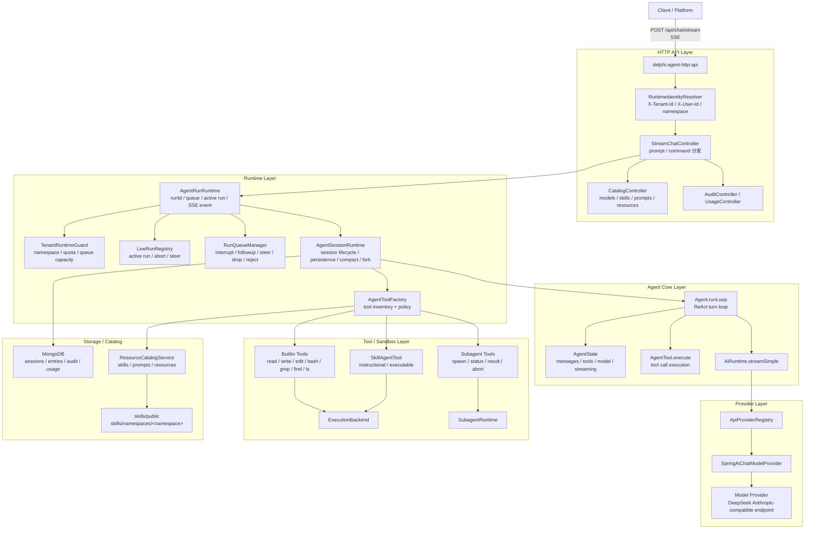
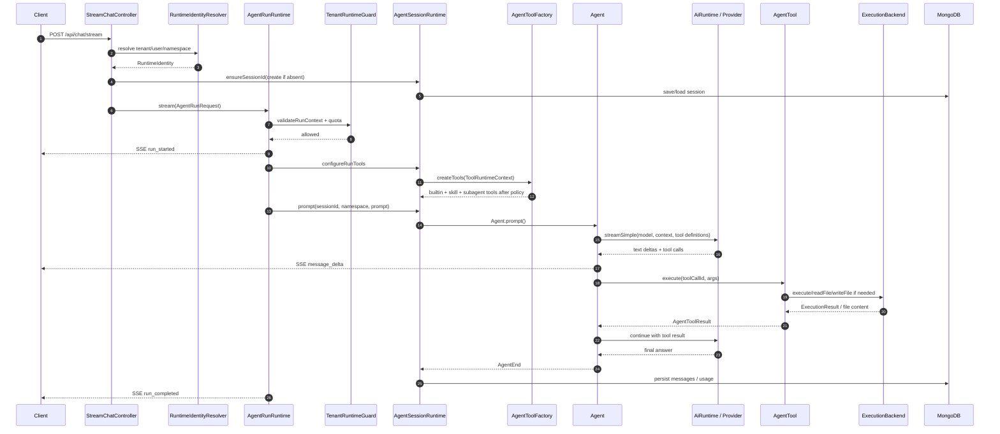
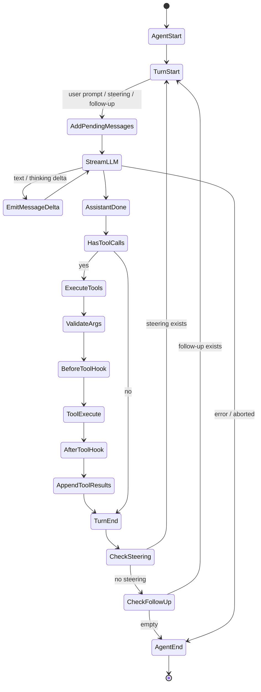
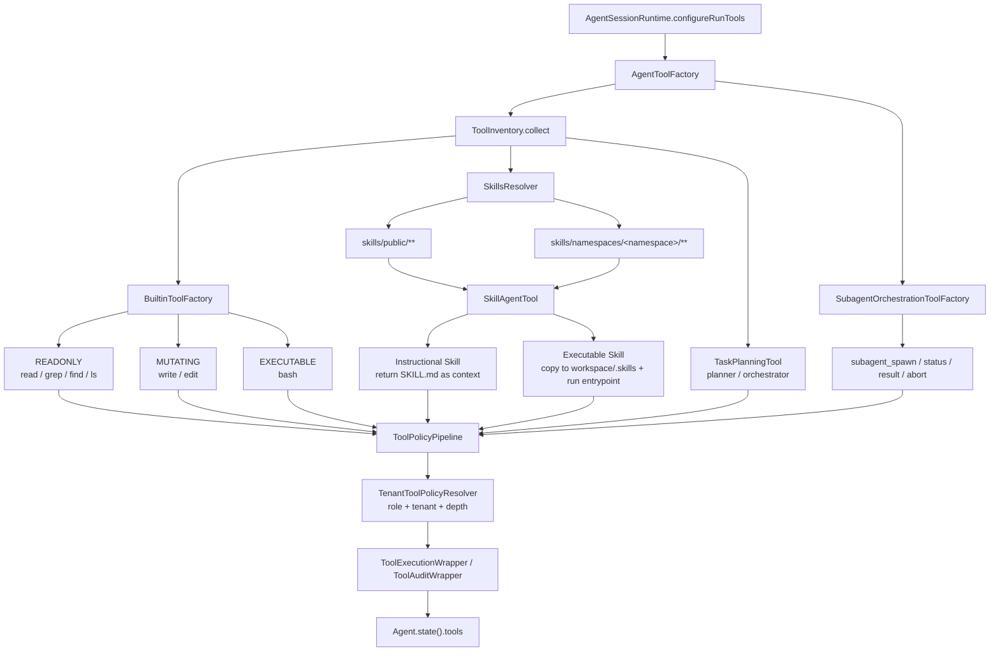
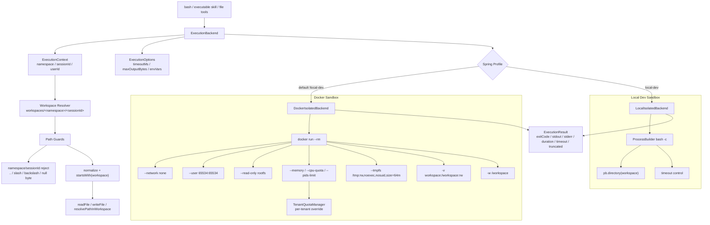
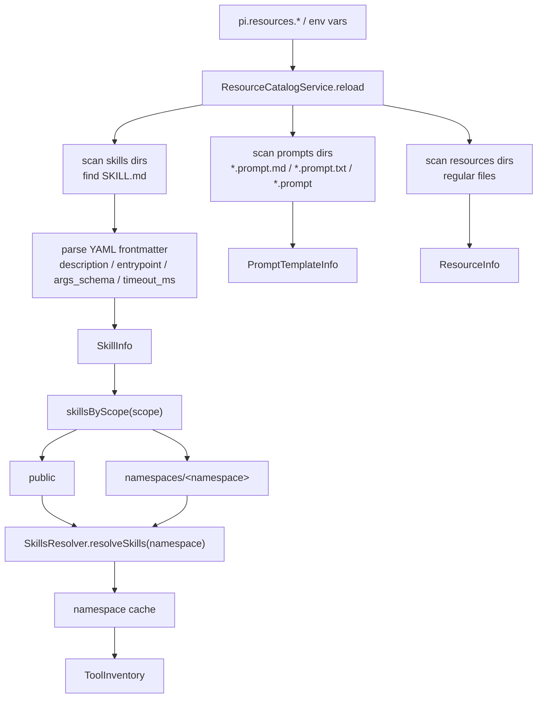
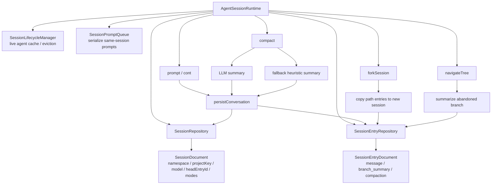
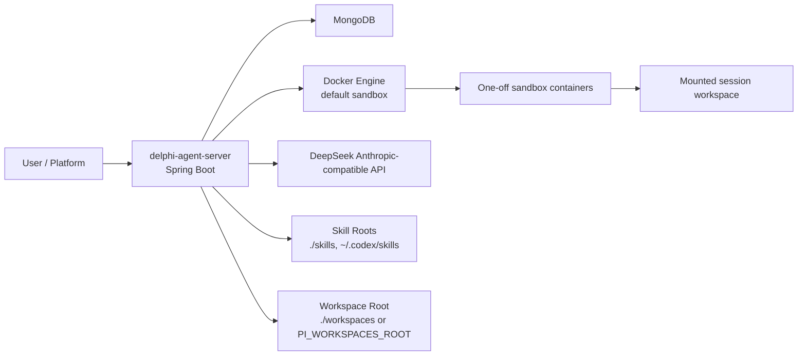

# Delphi Agent 技术架构

本文档集中描述 `delphi-agent` 的主要技术架构图，包括整体调用链路、运行时架构、Agent loop、工具与 skills、sandbox 技术架构和数据流。

## 1. 整体架构流程图

## 2. 请求运行时序图

## 3. Agent Loop 技术流程图

关键点：

- `Agent.runLoop()` 是核心 ReAct 循环，模型每一轮都可以返回文本和 tool calls。
- 工具调用前会经过 JSON Schema 参数校验和 `beforeToolCall` hook。
- 工具执行后会经过 `afterToolCall` hook，并以 tool result message 形式回灌上下文。
- steering 消息优先于 follow-up；二者都为空且模型不再调用工具时 run 结束。

## 4. 工具与 Skills 技术架构图

工具策略按角色裁剪工具：

| 角色 | 允许类别 |
| --- | --- |
| `ORCHESTRATOR` | 默认全部；严格模式只允许 `READONLY`、`INSTRUCTIONAL`、`ORCHESTRATION` |
| `PLANNER` / `RESEARCHER` | `READONLY`、`INSTRUCTIONAL` |
| `REVIEWER` | `READONLY` |
| `CODER` | `READONLY`、`MUTATING`、`EXECUTABLE`、`INSTRUCTIONAL` |
| `TESTER` | `READONLY`、`EXECUTABLE`、`INSTRUCTIONAL` |

## 5. Sandbox 技术架构图

Docker sandbox 的安全边界：

- 进程隔离：每次执行独立 `docker run --rm`。
- 网络隔离：`--network none`。
- 用户隔离：容器内使用 `65534:65534` 非 root 用户。
- 文件系统隔离：只读 rootfs，仅挂载当前 session workspace。
- 资源限制：CPU、memory、PIDs 可配置并支持租户覆盖。
- 输出限制：stdout/stderr 按 `maxOutputBytes` 截断。

`local-dev` backend 只提供路径和超时级别保护，不提供容器隔离，只适合开发调试。

## 6. Catalog 与 Skill 加载流程

## 7. 会话与持久化架构图

## 8. 部署与运行视图

最小运行依赖：

- JDK 21 + Maven 3.9+
- MongoDB
- `DEEPSEEK_API_KEY`
- Docker（默认 profile）

