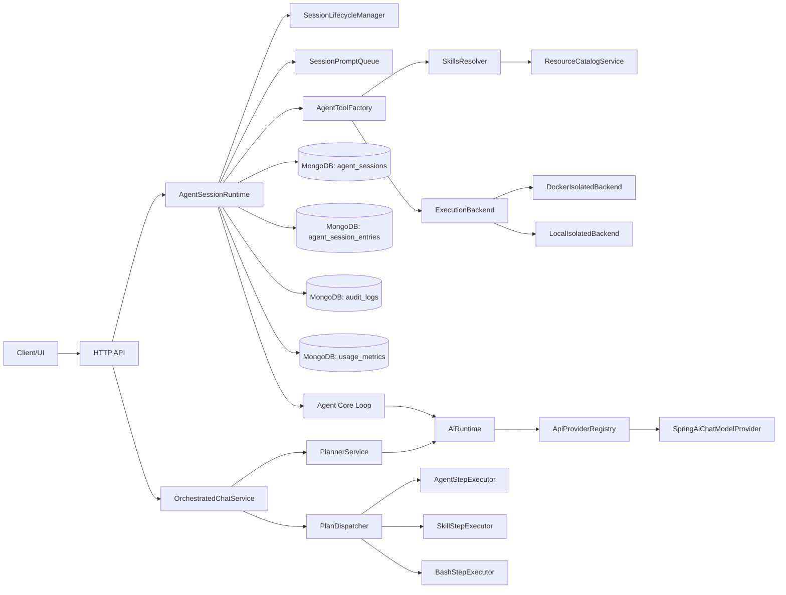
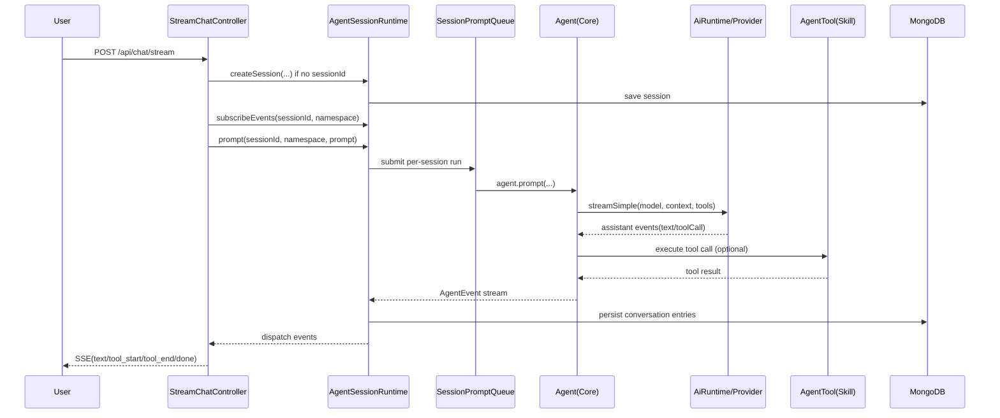
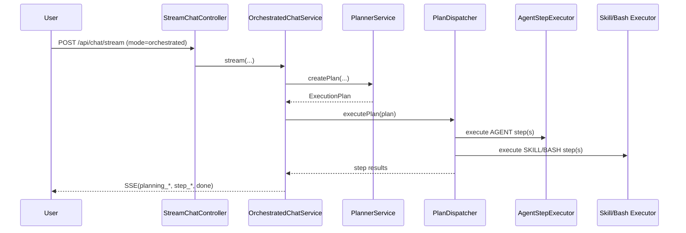
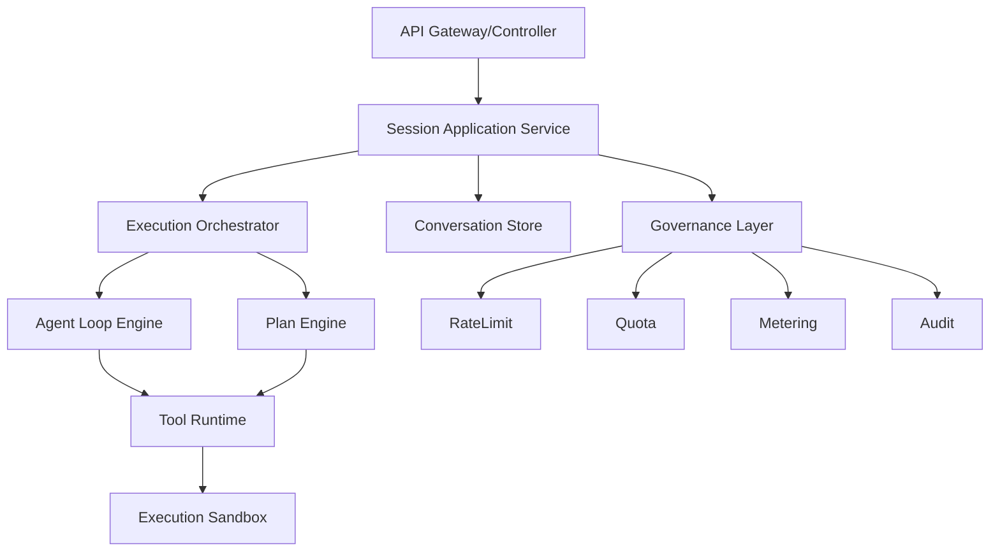

# Delphi-Agent 全面深度走查（2026-04-21）

## 1. 走查范围与方法

本次走查基于 `delphi-agent` 仓库当前实现，覆盖以下模块：

- `delphi-agent-server`
- `delphi-agent-http-api`
- `delphi-agent-runtime`
- `delphi-agent-core`
- `delphi-agent-ai-api`
- `delphi-agent-springai-provider`

走查方法：

1. 从入口（HTTP 控制器）反推到核心执行链路。
2. 对会话、编排、工具执行、持久化、隔离策略做端到端代码核对。
3. 对配置项、治理能力（限流/配额/审计/计量）做“定义 vs 生效”一致性检查。
4. 输出 `As-Is` 架构、核心链路流程、问题清单、`To-Be` 架构设计与落地路线图。

## 2. As-Is 架构全景

### 2.1 模块职责

| 模块 | 当前职责 |
| --- | --- |
| `delphi-agent-server` | Spring Boot 启动、模型注册、配置装配 |
| `delphi-agent-http-api` | 对外 HTTP/SSE（当前主要是 `/api/chat/stream` + `/api/catalog` + 审计/用量查询） |
| `delphi-agent-runtime` | Session 生命周期、持久化、技能目录解析、执行后端、编排执行、RPC 处理器、租户治理 |
| `delphi-agent-core` | Agent Loop、流式事件、工具调用编排（并行/串行） |
| `delphi-agent-ai-api` | Provider SPI、统一消息模型、事件流协议 |
| `delphi-agent-springai-provider` | Spring AI 适配，把流式响应转换为统一事件 |

### 2.2 运行时组件关系图

## 3. 核心链路流程

### 3.1 `/api/chat/stream`（Agent 模式）

当前默认链路是“Session + Agent Loop + 工具调用”。若请求未带 `sessionId`，会自动创建会话。

关键点：

- 同一个 session 的 prompt 串行执行（`SessionPromptQueue`），避免并发写消息。
- 工具调用可并行或串行（默认并行，见 `AgentOptions.defaults()`）。
- 每轮完成后把新增消息落盘到 `agent_session_entries`，并更新 `headEntryId`。

### 3.2 `/api/chat/stream`（orchestrated 模式）

`mode=orchestrated` 进入“先规划再执行”流水线：

1. `PlannerService` 用规划 Agent 生成 JSON 计划。
2. `PlanDispatcher` 按 `StepExecutorType` 执行步骤。
3. 通过 SSE 回推 `planning_*` / `step_*` / `tool_*` 事件。

### 3.3 Skill 工具执行链路

`SkillAgentTool` 有两条路径：

- `entrypoint` 存在：可执行 Skill。
- `entrypoint` 缺失：说明型 Skill（返回 SKILL.md 内容作为指令）。

可执行 Skill 执行过程：

1. 校验 entrypoint 格式（仅允许 `./...`）。
2. 把 skill 目录复制到 workspace 下 `.skills/<skill-name>`。
3. 通过 `ExecutionBackend.execute(...)` 在隔离环境执行。
4. stdout/stderr 封装回 `AgentToolResult`。

### 3.4 Session 树、分叉与压缩

- 分叉（`forkSession`）：复制指定 entry 路径，生成新 session。
- 导航（`navigateTree`）：切换到历史分支，支持对被放弃分支做摘要记录。
- 压缩（`compact`）：LLM 优先摘要历史消息，失败回退启发式摘要，然后重写分支。

## 4. 数据模型与状态管理

### 4.1 Mongo 集合

| 集合 | 作用 | 关键字段 |
| --- | --- | --- |
| `agent_sessions` | Session 元数据 | `namespace`, `modelProvider`, `modelId`, `headEntryId`, `persistedMessageCount` |
| `agent_session_entries` | 会话消息/分支事件 | `sessionId`, `entryId`, `parentId`, `type`, `payload` |
| `audit_logs` | 审计日志 | `namespace`, `sessionId`, `action`, `details`, `timestamp` |
| `usage_metrics` | 日粒度用量聚合 | `namespace`, `date`, `totalInputTokens`, `totalOutputTokens` |

### 4.2 内存态

- `SessionLifecycleManager` 维护 live agent（带 LRU + 空闲回收）。
- `SessionPromptQueue` 做 session 级串行化执行。
- `eventListeners` 把 AgentEvent 广播到 SSE 订阅方。

## 5. 多租户与隔离策略

### 5.1 namespace 约束

- HTTP 请求入口：`NamespaceValidator.validate(namespace)`。
- Runtime 入口：`validateNamespace(sessionId, namespace)` 校验会话归属。
- RPC 入口：强制 `namespace` 必填并执行路径穿越字符校验。

### 5.2 执行隔离

默认 `DockerIsolatedBackend`（非 `local-dev` profile）：

- `--network none`
- 非 root 用户
- read-only rootfs
- `--memory` / `--cpu-quota` / `--pids-limit`
- workspace 映射：`workspaces/<namespace>/<sessionId>`

`local-dev` 使用 `LocalIsolatedBackend`，仅目录级隔离，便于本地开发调试。

### 5.3 治理能力

- 限流：`RateLimiter`（每 namespace 滑动窗口 RPM）。
- 审计：`AuditService` 异步落库。
- 计量：`UsageMeteringService` 内存聚合 + 定时 flush。
- 配额：`TenantQuotaManager` 提供租户配额解析。

## 6. 问题清单（按优先级）

### P0（建议优先修复）

1. 对外 API 文档与实现存在明显漂移。
- README 声称暴露 `/api/sessions`、`/api/rpc`、`/api/skills`。
- 当前 `http-api` 实际只暴露 `/api/chat`、`/api/catalog`、`/api/audit`、`/api/usage`。
- 风险：调用方按文档接入会直接失败。

### P1（短期修复）

1. 限流拦截器可能失效。
- `RateLimitInterceptor` 依赖 `ContentCachingRequestWrapper` 读取 body namespace。
- 当前未看到显式 request-wrapping filter，拦截器可能读不到 body，从而放行。

2. 配置项存在“定义了但未生效”的情况。
- `pi.session.*`、`pi.compaction.*`、`pi.planning.timeout-seconds` 在代码路径中未真正接线使用（存在硬编码默认值）。

3. 编排结果未落盘到会话。
- `AgentSessionRuntime.persistOrchestrationResult(...)` 暴露了入口，但 `OrchestratedChatService` 当前未调用。
- 风险：orchestrated 模式产出不进入 session 消息树。

4. `autoRetryEnabled` 存储但未执行。
- runtime/rpc 有 set/get 入口，但未看到真正重试执行链路。

### P2（中期优化）

1. 配额能力只部分生效。
- `TenantQuota` 的 `cpu/memory/pids` 已用于 Docker 执行。
- `maxConcurrentSessions`、`dailyTokenLimit` 暂未在主流程强校验。

2. 计量存在“接口注释与行为不一致”。
- `UsageMeteringService.getTodayUsage` 注释写“cache miss 回查 Mongo”，当前实现只返回 cache 值。

3. 默认模型兜底逻辑可预测性不足。
- `/api/chat/stream` 在 provider/model 为空时取 `modelCatalog.getAll().get(0)`，顺序由注册遍历决定，不够显式。

## 7. To-Be 架构设计（建议）

### 7.1 目标设计原则

1. 北向接口稳定，文档和实现强一致。
2. 会话语义统一，Agent 模式和 Orchestrated 模式共用持久化与治理管道。
3. 配置驱动优先，去除运行时硬编码阈值。
4. 治理闭环：限流、配额、计量、审计与告警可联动。

### 7.2 建议目标拓扑

核心设计动作：

- 把 `/api/chat/stream` 与 session/rpc 控制面统一到一个 `Session Application Service`。
- 让 orchestrated 流程复用 session 的消息持久化、计量、审计、回放能力。
- 抽出 `Governance Layer`，在执行前后统一做限流、配额扣减、审计记录。

## 8. 分阶段落地路线图

### Phase 1（1-2 周）

1. 修正文档与实现漂移：README 只保留真实暴露 API，补充 SDK/RPC 内部能力说明。
2. 修复限流链路：增加 `OncePerRequestFilter` 包装 request body 或改为在 controller 层解析 namespace 后调用限流。
3. 配置接线：`pi.session.*`、`pi.planning.timeout-seconds`、`pi.compaction.*` 改为真实生效。

### Phase 2（2-3 周）

1. orchestrated 结果并入 session 消息树，支持回放与 fork。
2. 实现 `autoRetry` 真正执行策略（幂等保护 + 退避 + 上限）。
3. 补齐 `dailyTokenLimit`、`maxConcurrentSessions` 的硬性门禁。

### Phase 3（3-4 周）

1. 完整开放会话控制面 API（或删除过期能力声明）。
2. 治理面指标化与告警化（QPS、拒绝率、token 消耗、sandbox 失败率）。
3. 增加端到端兼容测试（Agent 模式、Orchestrated 模式、技能执行、跨租户拒绝、分支导航/压缩）。

## 9. 核心链路验收清单

发布前建议至少满足：

1. API 文档示例可以直接跑通（curl 级别）。
2. 同一 session 并发 prompt 不会造成乱序与数据覆盖。
3. Skill 可执行与说明型两条路径都可稳定返回。
4. namespace 越权访问稳定返回 4xx。
5. orchestrated 模式结果可追溯到 session 存储。
6. 限流/配额命中有可观测记录（日志 + 指标）。

---

如需继续推进，我建议下一步直接落地 `Phase 1`：先做“接口与文档一致性 + 限流生效 + 配置接线”三件事，这三项对平台可用性提升最大。
